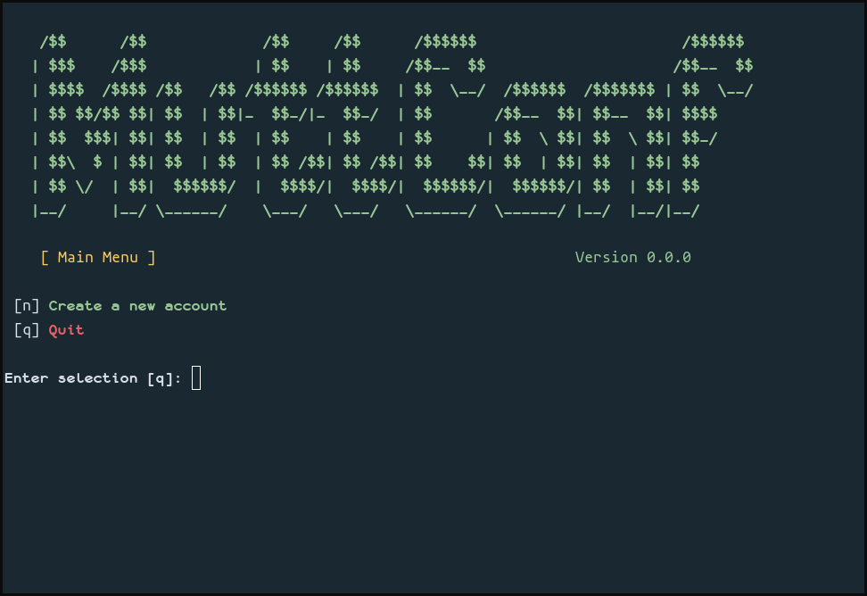

# MuttConf

MuttConf is a console-based application to aid in the creation of configuration files for Mutt/Neomutt.  
It's inspired by LukeSmithxyz/mutt-wizard with an emphasis on menu-based usage instead of commands.

## Usage

Clone the repo, then run `./muttconf`. You'll be greeted with a screen similar to this:

Press <kbd>n</kbd> to create a new account and follow the prompts to set things up.

Once you've entered the main account details you'll be prompted to enter and confirm your password,
which will be saved using LastPass CLI (if available) before your `muttrc` is generated and saved in
`~/.config/mutt/muttrc`. When that's done you can start Neomutt and it *should* just work™.
